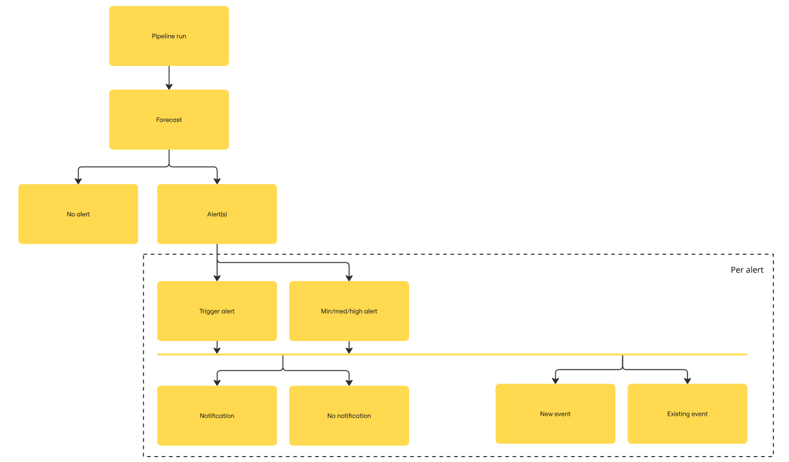

### Definition of IBF

A system that forecasts Early Warning alerts, disseminates notifications, and visualizes exposure information to support decision making, following the country advisory.

### System components & definitions

The components of **IBF** are

* **IBF portal**, i.e. the frontend
* **IBF API**, i.e. the backend
* **IBF pipelines**, i.e. implementations of trigger models
* **IBF database**

### Main Concepts

NOTE: sometimes concepts refer to other concepts, which may be lower in the list.

* **Hazard type**: IBF has separate pipelines per hazard type, such as *floods* and *drought*.
* **Pipeline run**: Each pipeline runs automatically with a certain frequency, which is hazard-type-specific, e.g. daily for *floods* or monthly for *drought*.
* **Forecast**: Every pipeline run produces a forecast, which can be either one (or more) *alert(s)* or *no alert*.
* **Forecast time**: Time when a forecast was issued, so when the pipeline was run.
* **Alert**: A forecast can be composed of one or more alerts, relating each to a different spatial and/or temporal extent, in which the severity is expected to exceed the minimum severity threshold.
* **Spatial extent**: Defines the spatial extent of an *alert* or *event*, whereby a country is split in hazard-type-relevant regions, such as catchment areas for *floods* and climate regions for *drought*.
* **Temporal extent**: Defines the temporal extent of an *alert* or *event*. *Floods* has one potential temporal extent: *0 days to 7 days*, where the actual *temporal extent* would the subset of these *lead times* that are actually part of the alert. *Drought* can have multiple temporal extents, representing multiple rain seasons in a year.
* **Alert class**: An *alert* is classified as a *minimum, medium or high alert* based on *severity* and *probability*.
* **Trigger**: An *alert* that has *alert class 'high'*, but additionally meets other *EAP* conditions, such as the high alert occurring before a specific lead-time such as 5 days. These conditions are hazard and country dependent. A *trigger* can be forecasted by the pipeline, or it can be "set" by a user based on a forecasted non-trigger alert.
* **EAP**: Early Action Protocol, which defines exact trigger conditions on country and hazard level.
* **Event**: Consecutive *alerts* on the same *spatial extent* and *temporal extents* are part of the same (long-living) *event*.
  * **Lead time**: Amount of time between forecast and a relevant forecasted moment, such as the *start time* of an *event*.
  * **Start time**: Event start time, as per the latest alert of this *event*. When an event becomes *ongoing*, this stabilizes at the start time where it first became *ongoing*.
  * **Ongoing**: An event is ongoing (at the *forecast time**) if the *forecast time* is later than the *start time*. As opposed to an *upcoming* event, if not.
  * **First issued time**: Time of forecast of the first *alert* of an *event*.
  * **Time of reaching peak alert class**: The (lead) time when an *alert* first reaches its highest *alert class*. Different from *start time*, as that may be earlier on a lower class already. Different from simple 'peak (lead) time', because the absolute peak can be later than the first time it crosses the highest threshold. The latter being the relevant time for EAP conditions.
  * **Severity**: Measure of severity of an alert, such as *water discharge* for *floods*. This measure is compared to severity thresholds to classify into *severity class*.
  * **Probability**: Measure of probability of an alert. For e.g. *floods*, this is the percentage of (GloFAS) model ensemble runs that exceed the threshold relating to the identified severity class. This gives additional information on top of the *severity* above, which is aggregate (median) severity across these ensemble runs.
  * **Exposure**: Measure of exposure of a forecasted event, such as *exposed population* (per admin-area) or *exposed hospitals*. This is not calculated per (lead time), but on aggregate alert level.
* **Set trigger**: A *trigger* that is manually set by a user based on a pipeline *non-trigger alert*. In contrast to an automatically classified trigger.
* **Notification**: An *alert* can or cannot lead to a notification, through *email* and/or *WhatsApp*.
* **Advisory**: Advisory is the call action set per *alert class*. It can (when available) refer to an *EAP* or another contingency plan document
* **Last upload time**: Last time the pipeline has successfully updated IBF API for a particular country and hazard-type.
* **Admin level**: Administrative level of administrative areas in a country, e.g. level 1 for Counties, 2 for Subcounties, 3 for Wards in Kenya.
* **Admin area**: Particular administrative area, e.g. county 'Baringo' in Kenya. Having a *placeCode* as unique identifier, having geo-data on boundaries, and having any number of indicators with datapoints related to it.
* **User role**: Role of a user, which determines what actions can be taken in the IBF Portal.

